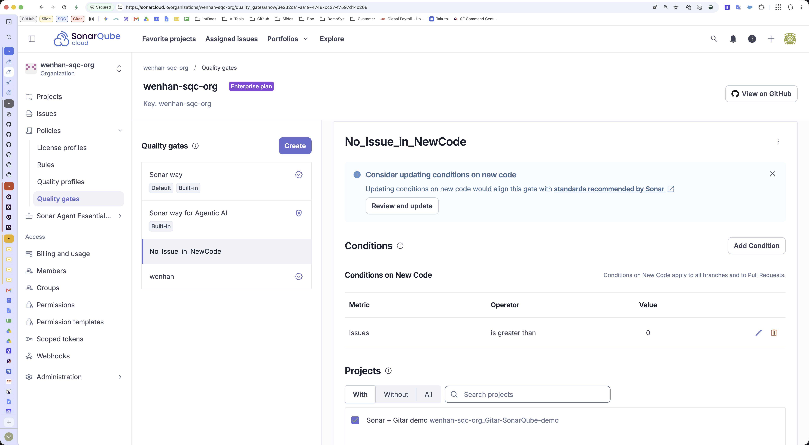

(pause: 1)


(font-size: 40)

```
 <Gitar 演示>
 Gitar 如何解决 SonarQube 问题以解除 PR 合并的阻塞
```

在此演示中,一个 Issue 未通过 SonarQube 的 Quality Gate,导致 PR 无法合并。我将展示 Gitar 如何修复该问题,使其通过 Quality Gate 并成功合并。

---

(pause: 1)


首先,让我们确认一下 Quality Gate 的设置。如果新代码中检测到一个或多个 Issue,Quality Gate 就会失败。
该项目已启用此 Quality Gate,如页面底部所示。

---

(pause: 1)


在 GitHub 端,我们从另一个分支创建一个合并到 master 的 PR。

---

(pause: 1)


PR 创建后,SonarQube 和 Gitar 都会开始对其进行分析。

---

(pause: 1)


过了一会儿,SonarQube 完成分析并检测到一个新的 Issue。结果,Quality Gate 未通过,导致合并被阻塞。

---

(pause: 1)


我们也在 SonarQube 的图形界面中确认一下。

---

(pause: 1)


Gitar 也完成了对该 PR 的分析,并发现了一些 Issue,其中也包括导致 Quality Gate 未通过的那个问题。

---

(pause: 1)


Gitar 的每条评论旁都有一个「Fix me」复选框,可以选择是否让 Gitar 来修复该问题。
在此演示中,我将让 Gitar 来修复它。
---

(pause: 1)


修复会在该 PR 上生成一个新的提交,从而触发新一轮的 SonarQube 扫描。
在 Quality Gate 通过之前,该 PR 仍然无法合并。

---

(pause: 1)


由于 Gitar 提交的修复解决了该问题,这次 Quality Gate 顺利通过,我们现在可以合并这个 PR 了。

---

(pause: 1)


本演示展示了 Gitar 与 SonarQube 协同工作的流程:检查代码、修复 Issue,并确保代码库的质量。工程师只需审核 Gitar 的修复即可,从而减少了修复问题所花费的时间。

本次演示到此结束。希望对大家有所帮助,我们下次再见!
